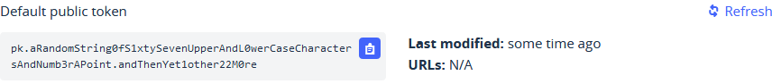
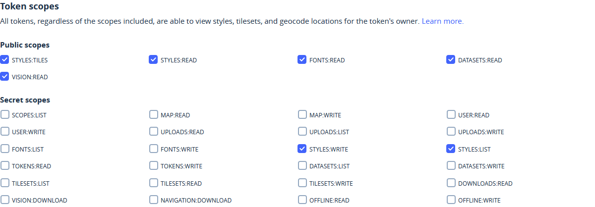
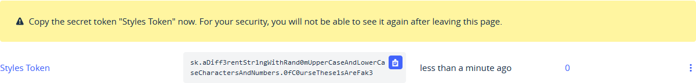

# Create a Mapbox account

## Get access to the Mapbox features

A Mapbox account can be created at the [signup](https://account.mapbox.com/auth/signup/) page.

When an account is created
you can go to [Tokens](https://account.mapbox.com/access-tokens/)
to see your find your **Default public token**.
This token is needed to **retreive** data and maps.

To create, edit and delete styles and other data you need a **secrect token**.

You can create one on the [Access tokens](https://account.mapbox.com/access-tokens/) page
by clicking the [+ Create a token](https://account.mapbox.com/access-tokens/create) button.
Give it a name and check at least the *STYLES* scopes as shown below.

Optionally you can enter URLs to restrict the use of the token to those URLs.

Click the "Create token" to, you guessed it, create the token.
After you have confirmed with your password.
The token is shown on the tokens page.
Pleas take note of warning and **do copy** the token as this is the last time it will be shown to you!

You can now add [shapes](shapefile.md) of countries and other territories
to your Mapbox account.
