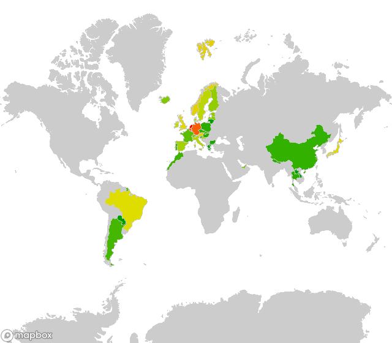

# Using external data

## Creating Choropleth maps of geocache finds  

The reason developed this module is because I want to update my geocaching profile with a colourful map.
You can get a so called pocked query of all the caches you have found.
A pocket query results in a [GPX-file](https://en.wikipedia.org/wiki/GPS_Exchange_Format).

<!--
All over the world caches are hidden.
A choropleth map is a nice way to show where you have found caches.
[Groundspeak, inc. DBA geocaching](https://groundspeak.com),
the company behind the largest database of caches,
makes the caches you have logged on their site available
in a so-called pocket query.
This a [GPX-file](https://en.wikipedia.org/wiki/GPS_Exchange_Format)
containing a list of waypoints of all those caches.
-->

Since a GPX-file is a [XML-file](https://en.wikipedia.org/wiki/XML),
the data can be extracted with ElementTree:

```python
import xml.etree.ElementTree as ET

# Set the location of the pocket-query file
pocket_query = '../data/pocket-query.gpx'

# Initialize a dict of countries
countries = {}

tree = ET.parse(pocket_query)
# Each wpt contains one country tag, loop over all the country tags
for country in tree.findall(".//{http://www.groundspeak.com/cache/1/0/1}country"):
    # get the name of the country
	# and increase the value of that country in the dict
    countries[country.text] = countries.get(country.text, 0) + 1

max_value = countries[max(countries, key=countries.get)]
```

Define a function to generate a nice range of colours.

```python
def color_from_value(val, max):
    c = math.log(val) / math.log(max_value)
    h = (1-c) * 120
	# the paint property can also be hsl (hue, saturation, lightness)
    return 'hsl(%d, %d%%, %d%%)' % (
        h,
        100,
        37.5+12.5*math.cos(math.radians(h))
    )
```

Use the data int the ```countries``` dict
to generate a set of coloured layers
and use that in a style.

```python
# define the name and id of the tileset
tileset_id = 'yourusername.t1ls3tid'
source_name = 'ne_10m_admin_0_countries-uniqid'

# Initialise the layer array with a grey landmass 
layers = [
    make_layer(source_name, make_paint('#CCC', '#CCC')),
]

# For each country append the coloured layer to the array
for (name, value) in countries.items():
    layers.append(
        make_layer(
            source_name,
            make_paint(
                color_from_value(value, max_value),
                '#CCC',
            ),    
            make_filter(name, 'NAME'),
        )
    )

# Make the style
style = make_style(
    stylename,
    add_sources([tileset_id]),
    layers
```

Use the style to create a map:


```python
# Set the keys in the global module variables
set_mapbox_token(
    public_key = 'pk.aRandomString0f5ixtySevenUpperAndL0werCaseCharactersAndNumb3rsPo1nt.andThenYet1other22M0re',
    secret_key = 'sk.aDiff3rentStr1ngWithRand0mUpperCaseAndLowerCaseCharactersAndNumbers.0fC0urseThese1sAreFak3',
)

# Check if there is already a style with the name
style_id = get_style_id_by_name(stylename, username=username)
if style_id:
    # Update if the style already exists
    style = update_style(username, style_id, style)
else:
    # Create the style if it's not
    style = create_style(username, style)
    
# Determine the url
url = mapbox_url(
    username = username, 
    style = style['id'], 
    latitude = 20,
    longitude = 10,
    width = 640,
    height = 560,
)

# Print the url
print(url)
```

This gives (for me) the following image:


