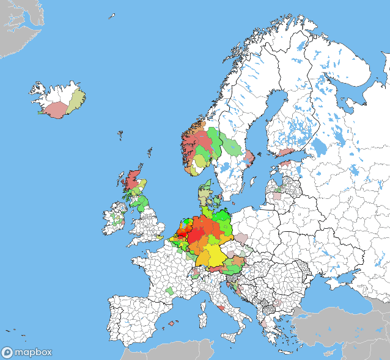

# Using different style types

## Creating Choropleth maps of geocache finds on county subdivision level  

In version 1.0.0 multiple style types are introduced. 
This chapter demonstrates the use of line and background next to the default paint type.

Since the [Groundspeak, inc. DBA geocaching](https://groundspeak.com) data 
doesn't provide us with the information
for all states, provinces, departments or whatever the national subdivision is called.
The [Natural Earth](https://www.naturalearthdata.com/) shape files are used.
The [PyShp](https://pypi.org/project/pyshp/) module
is used to read shapefiles 
and [Shapely](https://pypi.org/project/Shapely/)
to use them.


```python
import shapefile
from shapely.geometry import Point
from shapely.geometry import shape

import xml.etree.ElementTree as ET

# Set the location of the pocket-query file
pocket_query = '../data/pocket-query.gpx'
# Set the location of the shape files
shape_file_countries = '../data/ne_50m_admin_0_countries/ne_50m_admin_0_countries'
shape_file_states = '../data/ne_10m_admin_1_states_provinces/ne_10m_admin_1_states_provinces'

# Read the shapefiles
sf_countries = shapefile.Reader(shape_file_countries)
sf_states = shapefile.Reader(shape_file_states)

property_countries = sf_countries.records()
property_states = sf_states.records()

geometry_states = sf_states.shapes()
geometry_countries = sf_countries.shapes()

# Initialize a dict of countries
countries = [0]*len(geometry_countries)
states = [0]*len(geometry_states)
country_states = [[] for i in range(len(geometry_countries))]

# Parse the pocked query
tree = ET.parse(pocket_query)
for w, wpt in enumerate(tree.findall(".//{http://www.topografix.com/GPX/1/0}wpt")):
    pt = Point(float(wpt.attrib['lon']), float(wpt.attrib['lat'])) # an x,y tuple
    for i, geometry_country in enumerate(geometry_countries):
        # Only for Europe
        if 'Europe' == property_countries[i]['CONTINENT']:
            boundary = shape(geometry_country)
            if pt.within(boundary):
                countries[i] += 1
                for j, geometry_state in enumerate(geometry_states):
                    if property_states[j]['adm0_a3'] == property_countries[i]['ADM0_A3']:
                        boundary = shape(geometry_state)
                        if pt.within(boundary):
                            states[j] += 1
                            if j not in country_states[i]:
                                country_states[i].append(j)
                            continue
                continue
```

Utility functions to generate the colours.
The [colorsys](https://docs.python.org/3/library/colorsys.html)
is used to juggle with colour spaces.
```python
from colorsys import *

def log_value(val, min, max):
    if val == max: return 1
    if val == min: return 0
    return math.log(val-min) / math.log(max-min)

def color_to_hex(rgb):
    return '#%02x%02x%02x' % (
        math.floor(rgb[0]*255.99),
        math.floor(rgb[1]*255.99),
        math.floor(rgb[2]*255.99)
    )
def color_from_value(val, max, min = 0):
    #print('color_from_value(', val, max, min, ')')
    if val == max: return(1, 0, 0)
    if val == min: return(0, 1, 0)
    c = log_value(val, min, max)
    if c < 0.5: return (c*2, 1, 0)
    else: return (1, 2-c*2, 0)    

def decolorise(d, color):
    hls = rgb_to_hls(*color)
    return hls_to_rgb(hls[0], (1-hls[1]*d), hls[2]*d)
```

Use the data to generate a set of coloured layers:
```python
from mapboxutil import *

# define the names and id's of the tilesets
source_name_countries = 'ne_10m_admin_0_countries-8altm2'
source_name_states = 'ne_10m_admin_1_states_provinc-3bpwyy' 
source_name_lakes = 'ne_10m_lakes-26xzk5'

tileset_id_countries = 'yourname.5uk8mpdb'
tileset_id_states = 'yourname.9a65spfb'
tileset_id_lakes = 'yourname.a6tibcwv'

# define the colour of water areas
colour_water = '#78bced'
max_countries = max(countries)

layers = [
    # The background is the colour of water
    make_layer('', make_paint(colour_water), type='background'),
    # Landmass is white by default
    make_layer(source_name_states, make_paint('#FFF')),
]

property_name = 'ne_id'
min_decol = 0.25
offset = 1

for i,country in enumerate(countries):
    if 0 != country:
        # The more caches found in a country, the less it gets decolourised 
        decol = min_decol + log_value(country + offset, 1 + offset, max_countries + offset, func) * (1 - min_decol)

        # Determine the minimum and maximum number of caches found in a subdivision of a country
        max_state = 0
        min_state = 1E8
        for state in country_states[i]:
            if max_state < states[state]: max_state = states[state]
            if min_state > states[state]: min_state = states[state]
        for state in country_states[i]:
            layers.append(
                make_layer(
                    source_name_states,
                    make_paint(
                        color_to_hex(
                            decolorise(
                                decol,
                                color_from_value(states[state], max_state, min_state)
                            )
                        )
                    ),
                    make_filter(property_states[state][property_name], property_name),
                )
            )

layers.extend([
    # A thin line as border between the country subdivisions
    make_layer(source_name_states, make_paint('#666', 0.1), type = 'line'),
    # Colour landmass outside of Europe gray
    make_layer(source_name_countries, make_paint('#BBB', '#DDD'), make_filter('Europe', 'CONTINENT', False)),
    # Thick and darker border lines between the countries in europe
    make_layer(source_name_countries, make_paint('#000', 0.3), make_filter('Europe', 'CONTINENT'), type='line'),
    # Add lakes to the map.
    make_layer(source_name_lakes, make_paint(colour_water)),
])
```

Use the layers in a style and generate a map from that style:
```python
# Set the keys in the global module variables
set_mapbox_token(
    public_key = 'pk.aRandomString0f5ixtySevenUpperAndL0werCaseCharactersAndNumb3rsPo1nt.andThenYet1other22M0re',
    secret_key = 'sk.aDiff3rentStr1ngWithRand0mUpperCaseAndLowerCaseCharactersAndNumbers.0fC0urseThese1sAreFak3',
)

# Define the style
style = make_style(
    stylename,
    add_sources([tileset_id_countries, tileset_id_states, tileset_id_lakes]),
)

#style = get_style(username, 'ckeu46t5h9czl19qqbzg21l7b') #mono
#add_sources([tileset_id], style['sources'])
style['layers'].extend(layers)


style['name'] = stylename;

# Check if there is already a style with the name
style_id = get_style_id_by_name(stylename, username=username)
if style_id:
    # Update if the style already exists
    style = update_style(username, style_id, style)
else:
    # Create the style if it's not
    style = create_style(username, style)
    style_id = style['id']
    
# Determine the url
url = mapbox_url(
    **{
        **mapbox_dimensions(
            south =   34,
            north =   72,
            west  =  -30,
            east  =   45,
            width =  640,
            height=  640,
        ),
        **{
            'username': username,
            'style': style_id,
            #'width': 640,
            #'height': 480,
            'test': True,
        }
    }
)
# Print the url
print(url)
```
This gives (for me) the following image:


