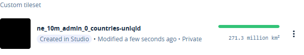
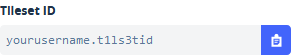

# Uploading shapefiles to Mapbox

## How to put Natural Earth and other shapefiles on Mapbox

  The first step in creating cholopleth maps is defining the shape of the countries (or other areas) we want to map.
This method uses [ESRI](https://www.esri.com)'s shapefiles. 
  Finding an up to date shapefile can be a difficult or expensive.
I've found the volunteers at [Natural Earth](https://www.naturalearthdata.com) 
are maintaining a set of [public domain](https://en.wikipedia.org/wiki/Public_domain) map data.

  To get the data used in this example:
Go to [Downloads](https://www.naturalearthdata.com/downloads/)
Select the [Cultural](https://www.naturalearthdata.com/downloads/10m-cultural-vectors/) data with the highest resolution
and download the [Countries](https://www.naturalearthdata.com/http//www.naturalearthdata.com/download/10m/cultural/ne_10m_admin_0_countries.zip) data.

  This will put all the data in a [.zip](https://en.wikipedia.org/wiki/Zip_(file_format))-file.
Coincidentally Mapbox requires the shapefiles to be uploaded in a zip-file.
  Go to Mapbox [Studio](https://studio.mapbox.com/) and 
select [Tilesets](https://studio.mapbox.com/tilesets/)
There the zipfile can be zipfile can be uploaded.

  **Attention**: The shapefile needs to be converted.
That will take some time,
so the data will not appear immediately on the page.
After some time the the following will be added to the tileset page:

As you can see an unique id will be added to the name of the tileset.

That is not the only id. 
Each tileset has also it's own id.
You can see that by clicking on the tileset.
The tileset can be seen in the URL
and in the field in the upper right corner of the screen.

This tileset can now be used in a Mabox [style](style.md).
