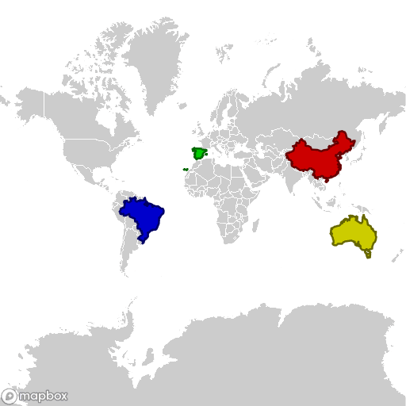
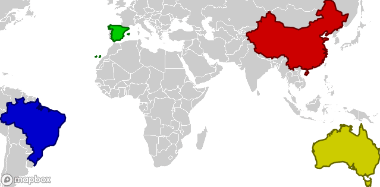

# Create the Static Map

## Using the Mapbox Static Images API to get map images

When using the [Static Images API](https://docs.mapbox.com/api/maps/static-images/)
(Form now on API for short)
to generate images,
many parameters have to be combined into a URL.
The following function takes those parameters and returns the URL.
By default, it generates a map of the whole world.

```python
def mapbox_url(
    username = 'mapbox'
    , style = 'streets-v11'
    , latitude = 0
    , longitude = 0
    , width = 512
    , height = 512
    , zoom = 0
    , overlays = []
    , access_token = None
):
    """
    Generates the url for the static mapbox image.
    :param username: The username owning the style
    :param style:           The style name to be used for the map
    :param latitude:        The latitude of the center of the map in degrees
    :param longitude:       The longitude of the center of the map in degrees
    :param width:           The width of the map in pixels
    :param height:          The height of the map in pixels
    :param zoom:            The zoom level used in the map
    :param overlays:        An array of overlays that will be added to the map
    :param access_token:    The MapBox public access token
    :return:    url to ret
    """
    if not access_token: access_token = _MAPBOX_PUBLIC_KEY
    overlay = ','.join(overlays)
    if overlay: overlay += '/'
    return 'https://api.mapbox.com/styles/v1/%(username)s/%(style)s/static/%(overlay)s%(longitude)s,%(latitude)s,%(zoom)s/%(width)dx%(height)d?access_token=%(access_token)s' % locals()
```

To use our style, the ```username``` and ```style_id``` have to be given
and the ```_MAPBOX_SECRET_KEY``` set.
```python
username = 'yourusername'
style_id = 'y0ur5tyle1d25alphanumchar'
_MAPBOX_PUBLIC_KEY = 'pk.aRandomString0f5ixtySevenUpperAndL0werCaseCharactersAndNumb3rsPo1nt.andThenYet1other22M0re'
url = mappbox_url(username, style_id)
```
This will show the map of the whole world with the four coloured countries.



Usually only a part of the world needs to be shown.
Mapbox uses the
[Web Mercator](https://en.wikipedia.org/wiki/Web_Mercator_projection) projection.

To convert latitude and longitude to Web Mercator coordinates
and back the following formulas
(coded in Python)
can be used:

```python
def latitude_to_webmercator(latitude):
    """Convert a latitude (in degrees) to web mercator."""
    return math.pi - math.log(math.tan((math.pi/2 + math.radians(latitude))/2))

def longitude_to_webmercator(longitude):
    """Convert a longitude (in degrees) to web mercator."""
    return math.radians(longitude) + math.pi

def webmercator_to_latitude(web_mercator):
    """Convert web mercator to latitude (in degrees)."""
    return math.degrees(2 * math.atan(math.exp(math.pi - web_mercator)) - math.pi/2)

def webmercator_to_longitude(web_mercator):
    """Convert web mercator to longitude (in degrees)."""
    return math.degrees(web_mercator - math.pi)
```
The coordinates in pixels are dependent of the zoom level.
The code below calculates the zoom factor and center of the map
for the given borders and size.

```python
def get_zoom(web_mercator, pixel):
    """Get the zoom level from size in web mercator and number of pixels."""
    return math.log(pixel * math.pi / web_mercator / 256, 2)

def mapbox_dimensions(south, north, west, east, width, height):
    """
    Get the parameters for a static mapbox image.

    :param south: The southern border (in degrees)
    :param north: The northern border (in degrees)
    :param west: The western border (in degrees)
    :param east: The eastern border (in degrees)
    :param width: The resulting width of the image (in pixels)
    :param height: The resulting width of the image (in pixels)
    :return: a dict with parameters for the mapbox_url function
    """
    # convert to webmercator
    south_wm = latitude_to_webmercator(south)
    north_wm = latitude_to_webmercator(north)
    west_wm = longitude_to_webmercator(west)
    east_wm = longitude_to_webmercator(east)

    # size in web mercator
    width_wm  = east_wm  - west_wm
    height_wm = south_wm - north_wm

    zoom = round(
        max(
            0, # Zoom levels cannot be negative
            min(                             # Calculate zoom levels for
                get_zoom(height_wm, height), # heigth and
                get_zoom(width_wm,  width)   # width
            )                                # and take the lowest value
        )
        , 2 # zoom levels will be rounded to two decimal places
    )
    # Zoom factor to convert web mercator to pixels
    zoom_factor = 256/math.pi * 2**zoom

    return {
        'width':  round(width_wm  * zoom_factor),
        'height': round(height_wm * zoom_factor),
        'latitude':  webmercator_to_latitude( (north_wm + south_wm) / 2),
        'longitude': webmercator_to_longitude((west_wm  + east_wm ) / 2),
        'zoom': zoom,
    }
```

The following borders will be used:

|Direction| Degrees | Name
|------|-----------:|----------|
|North |  53.550000 | [Mohe](https://en.wikipedia.org/wiki/Mohe_City) |
|East  | 153.638889 | [Cape Byron](https://en.wikipedia.org/wiki/Cape_Byron) |
|South | -43.643611 | [South East Cape](https://en.wikipedia.org/wiki/South_East_Cape) |
|West  | -73.984444 | [Serra do Divisor](https://en.wikipedia.org/wiki/Sierra_del_Divisor) |

The ```mapbox_dimensions``` function converts the borders to
the center latitude and longitude,
the zoom level,
and the width and height of the image.

```python
url = mapbox_url(
    **{ 
        **mapbox_dimensions(
            south = -43.643611, 
            north =  53.550000, 
            west  = -73.984444, 
            east  = 153.638889, 
            width = 640,
            height= 480
        ),
        **{'username': username, 'style': style_id }
    }
)
```
Just as the Google API the size of the image is reduced
so the borders in the code are also the borders of the image.


To add a margin to the image,
calculate the image with a width and height
two times the desired margin smaller.

To get the width and height you desire,
add these to the parameters.

```python
url = mapbox_url(
    **{ 
        **mapbox_dimensions(
            south = -43.643611, 
            north =  53.550000, 
            west  = -73.984444, 
            east  = 153.638889, 
            width = 600,
            height= 360
        ),
        **{
            'username': username, 
            'style': style_id, 
            'width': 640,
            'height': 400,
        }
    }
)
```



It's possible to add overlays to the image.
The statement to generate a marker 
can be created with the code below:

```python
def overlay_marker(
    latitude
    , longitude
    , color = ''
    , label = ''
    , size = 's'
):
    """
    Generate the partial url for a marker overlay
    :param latitude:    The latitude of the maker in degrees
    :param longitude:   The longitude of the marker in degrees
    :param color:       The 3- or 6-digit hexadecimal color code
    :param label:       The label, see MapBox documentation for the options.
    :param size:        The size options are 'l' (large) or 's' (small)

    :return: the url part for an marker overlay.
    """
    name = 'pin-s' if 's' == size else 'pin-l'
    if color: color = '+' + color
    if label: label = '-' + label
    return '%(name)s%(label)s%(color)s(%(longitude)s,%(latitude)s)' % locals()
```

Mark the Olympic cities in the countries: 

|Olympic year| City                                                     | Latitude  | Longitude |
|------------|----------------------------------------------------------|----------:|----------:|
| 2016 | [Rio de Janeiro](https://en.wikipedia.org/wiki/Rio_de_Janeiro) |-43.205916 |-22.911366 |
| 2008 | [Beijing](https://en.wikipedia.org/wiki/Beijing)               |116.397500 | 39.906667 |
| 2000 | [Sydney](https://en.wikipedia.org/wiki/Sydney)                 |151.209444 |-33.865000 |
| 1992 | [Barcelona](https://en.wikipedia.org/wiki/Barcelona)           |  2.183333 | 41.383333 |

By adding the overlays:
```
url = mapbox_url(
    **{ 
        **mapbox_dimensions(
            south = -43.643611, 
            north =  53.550000, 
            west  = -73.984444, 
            east  = 153.638889, 
            width = 600,
            height= 360
        ),
        **{
            'username': username, 
            'style': style_id, 
            'width': 640,
            'height': 400,
            'overlays': [
                overlay_marker(-22.911366, -43.205916, '66F', 'r'), # Rio de Janeiro
                overlay_marker( 39.906667, 116.397500, 'F66', 'p'), # Beijing/Peking
                overlay_marker(-33.865000, 151.209444, 'FF6', 's'), # Sidney
                overlay_marker( 41.383333,   2.183333, '6F6', 'b'), # Barcelona
            ]
                
        }
    }
)
```

That gives the final result:


