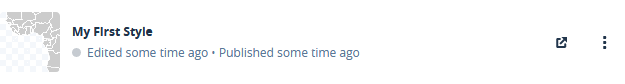
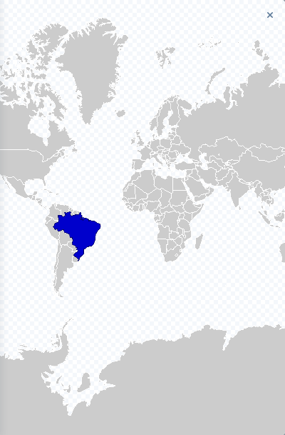

# Create styles
## Using JSON to create and edit styles in a (python) program

It's possible to create and edit a style in Mabox Studio.
To convert the data to a choropleth map automatic 
the Mapbox [Styles API](https://docs.mapbox.com/api/maps/#styles) is used.
The code examples are in [python](https://www.python.org/).
The [requests](https://2.python-requests.org) package is uses for http(s) request.
Below wrapper code to send and receive [JSON](https://www.json.org) messages.

```python
import requests

def delete_request(url):
    """Send a delete request to the url, returns the json payload."""
    r = requests.delete(url)
    if 204 != r.status_code:
        raise Exception(r.status_code, r.text, url)
    return r.json()

def get_request(url):
    """Send a get request to the url, returns the json payload."""
    r = requests.get(url)
    if 200 != r.status_code:
       raise Exception(r.status_code, r.text, url)
    return r.json()
    
def patch_request(url, data):
    """Send a patch request to the url, returns the json payload."""
    r = requests.patch(url, json=data)
    if 200 != r.status_code:
        raise Exception(r.status_code, r.text, url)
    return r.json()

def post_request(url, data):
    """Send a post request to the url, returns the json payload."""
    r = requests.post(url, json=data)
    if 201 != r.status_code:
        raise Exception(r.status_code, r.text, url)
    return r.json()
```

Also functions to create, retreive (get), update and delete styles.
The so called CRUD functions.
These functions assume a global varialbe ```_MAPBOX_SECRET_KEY``` is defined.
See the [account](account.md) page for how to get one.

```python
_MAPBOX_SECRET_KEY = 'sk.aDiff3rentStr1ngWithRand0mUpperCaseAndLowerCaseCharactersAndNumbers.0fC0urseThese1sAreFak3'

def create_style(username, style = {}):
    """Create a style."""
    return post_request('https://api.mapbox.com/styles/v1/%s?access_token=%s' % (
        username,
        _MAPBOX_SECRET_KEY
    ), style)

def delete_style(username, style_id):
    """Delete a style."""
    return delete_request('https://api.mapbox.com/styles/v1/%s/%s?access_token=%s' % (
        username,
        style_id,
        _MAPBOX_SECRET_KEY,
    ))

def get_style(username, style_id):
    """Retreive a style."""
    return get_request('https://api.mapbox.com/styles/v1/%s/%s?access_token=%s' % (
        username,
        style_id,
        _MAPBOX_SECRET_KEY,
    ))

def update_style(username, style_id, style):
    """Update an existing style."""
    return patch_request('https://api.mapbox.com/styles/v1/%s/%s?access_token=%s' % (
        username,
        style_id,
        _MAPBOX_SECRET_KEY,
    ), style)
```

The most basic style consist of a *version* number of the style.
Currently version 8 is used.
The *name* of the style.
**Attention**: name is **not** a unique identifier.
Several styles with the same name can exist,
even for the same user!
The unique identifier is the style_id.
It will be returned (amongst other information) when the style is created.
And also *layers*, *metadata* and *sources*.
These last three can be empty.

The function below will make a basic style:

```python
def make_style(
    """Make a style."""
    name = ''
    , sources = {}
    , layers = []
    , version = 8
):
    return {
        'draft': False,
        'name': name,
        'layers': layers,
        'metadata': {},
        'sources': sources,
        'version': version,
    }
```

Use the code above to create a style.

```python
# Define variables for later use
username = 'yourusername'
style_name = 'My First Style'
style = create_style(username, make_style(style_name))
```

This will return a json object.
Extra data data has been added to the style:
Metadata like the id and the time the style was created/modified.
The location for resources like glyphs and sptites have also been added.

```json
{
    "created": "2000-03-09T03:15:01.618Z",
    "glyphs": "mapbox://fonts/mapbox/{fontstack}/{range}.pbf",
    "id": "y0ur5tyle1d25alphanumchar",
    "layers": [],
    "metadata": {},
    "modified": "2000-03-09T03:15:01.618Z",
    "name": "My First Style",
    "owner": "yourusername",
    "sources": {},
    "sprite": "mapbox://sprites/yourusername/y0ur5tyle1d25alphanumchar/an0ther25chars7o1dsprit3s",
    "version": 8,
    "visibility": "private"
}
```

When looking at the style in [Studio](https://studio.mapbox.com/) only a transparant image will be shown:


This is because there has no data been supplied.
Layers, created from sources that have to be painted.
The following functions are used to create those.

```python
def add_sources(source_ids, sources = {}):
    """Add an array of source ids to the dict sources and return it."""
    url = sources.get('composite', {}).get('url', '')
    url += ',' if url else 'mapbox://'
    sources['composite'] = {
        'type': 'vector',
        'url': url + ','.join(source_ids),
    }
    return sources

def make_layer(source_layer, paint, filter = None):
    """Make a layer."""
    hash = hashlib.sha224(json.dumps(locals()).encode()).hexdigest()
    layer = {
        'id': 'layer%s' % (hash, ),
        'paint': paint,
        'source': 'composite',
        'source-layer': source_layer,
        'type': 'fill',
    }
    if filter:
        layer['filter'] = filter
    return layer

def make_paint(
    fill_color = None
    , fill_outline_color = None
    , fill_opacity = None
):
    """Make a paint property."""
    paint = {}
    if fill_color: paint['fill-color'] = fill_color
    if fill_outline_color: paint['fill-outline-color'] = fill_outline_color
    if fill_opacity: paint['fill-opacity'] = fill_opacity
    return paint
```

To get the map in the style,
the [shapefile](shapefile.md) that was added as a
[tileset](https://studio.mapbox.com/tilesets/) in a previous section.
There you can also find how to get the *tileset_id* and *source_name*

The python script below
will add the shapefile to both the **sources** and the **layers**
and will colour the countries gray with a white border.
In the ```make_paint``` method you can set the colour of the countries and borders. 

```python
tileset_id = 'yourusername.t1ls3tid'
source_name = 'ne_10m_admin_0_countries-uniqid'

style['sources'] = add_sources([tileset_id])
style['layers'] = [
    make_layer(
        source_name,
        make_paint('#CCC', '#FFF')    
    )
]
style = update_style(username, style['id'], style)
```
Now the map is visible in the style:



It's possible the preview isn't updated.
Click on "share your style", the box with the arrow to see the updated style.

To give seperate colour,
the shape needs to be added again to the layers in a different colour,
but with a filter, 
so only the country matching that filter will be shown.

The following code will generate the filter that can be added to the layer:
```python
def make_filter(value = 0, key = 'id'):
    if key == 'id': id = ['id']
    else: id = ['get', key]    
    return ['match', id, value, True, False]
```

Like this:

```python
style['layers'].append(
    make_layer(
        source_name,
        make_paint('#009', '#003'),
        make_filter(46)
    )
)
```

The polygon with id number 46 represents Brasil.
Brasil is not visible in the thumbnail.
Clicking the "Share your style" button
shows the style with Brasil like the image below.



You can use Studio to find the id of countries,
but the more easy way is to use the extra attributes included in the shapefile.
[Natural Earth](https://www.naturalearthdata.com/) adds many attributes.
The code below shows how to use some of them in a layer:

```python
style['layers'] = style['layers'] + [
    make_layer(
        source_name,
        make_paint('#C00', '#600'),
        make_filter('China', 'NAME')
    ),
    make_layer(
        source_name,
        make_paint('#CC0', '#660'),
        make_filter('AU', 'ISO_A2')
    ),
    make_layer(
        source_name,
        make_paint('#0C0', '#060'),
        make_filter('ESP', 'ISO_A3')
    ),
]
style = update_style(username, style['id'], style)
```

This will give the following style:

```json
{
    "created": "2000-03-09T03:15:02.718Z",
    "glyphs": "mapbox://fonts/mapbox/{fontstack}/{range}.pbf",
    "id": "y0ur5tyle1d25alphanumchar",
    "layers": [
        {
            "id": "layer2456eb061307eaabd00ce25a81c82e589618043c84b021cddf805fa8",
            "paint": {"fill-color": "#CCC", "fill-outline-color": "#FFF"},
            "source": "composite",
            "source-layer": "ne_10m_admin_0_countries-uniqid",
            "type": "fill"
        },
        {
            "filter": ["match", ["id"], 46, True, False],
            "id": "layer80d6c25a8edeb8d2629dfb976801f4e1b934751cea99bc0649ee4d6c",
            "paint": {"fill-color": "#00C", "fill-outline-color": "#006"},
            "source": "composite",
            "source-layer": "ne_10m_admin_0_countries-uniqid",
            "type": "fill"
        },
        {
            "filter": ["match", ["get", "NAME"], "China", True, False],
            "id": "layer340d44cd437040b6d5443346bae2e6ae67ea42d1dc7df7f148cd7d3d",
            "paint": {"fill-color": "#C00", "fill-outline-color": "#600"},
            "source": "composite",
            "source-layer": "ne_10m_admin_0_countries-uniqid",
            "type": "fill"
        },
        {
            "filter": ["match", ["get", "ISO_A2"], "AU", True, False],
            "id": "layere5e83e91e194bcceabaa00ddba7c0fda9fd047d60a6de8d29bed60e9",
            "paint": {"fill-color": "#CC0", "fill-outline-color": "#660"},
            "source": "composite",
            "source-layer": "ne_10m_admin_0_countries-uniqid",
            "type": "fill"
        },
        {
            "filter": ["match", ["get", "ISO_A3"], "ESP", True, False],
            "id": "layer1c816f39a246371acba4c8811b372cf72018b0b50897d9c9667c3d8c",
            "paint": {"fill-color": "#0C0", "fill-outline-color": "#060"},
            "source": "composite",
            "source-layer": "ne_10m_admin_0_countries-uniqid",
            "type": "fill"
        }
    ],
    "modified": "2000-03-09T03:15:02.718Z",
    "name": "My First Style",
    "owner": "yourusername",
    "sources": {"composite": {"type": "vector",
                "url": "mapbox://yourusername.t1ls3tid"}},
    "sprite": "mapbox://sprites/yourusername/y0ur5tyle1d25alphanumchar/an0ther25chars7o1dsprit3s",
    "version": 8,
    "visibility": "private"
}
```

This style can be used to create a [static map](static.md).
